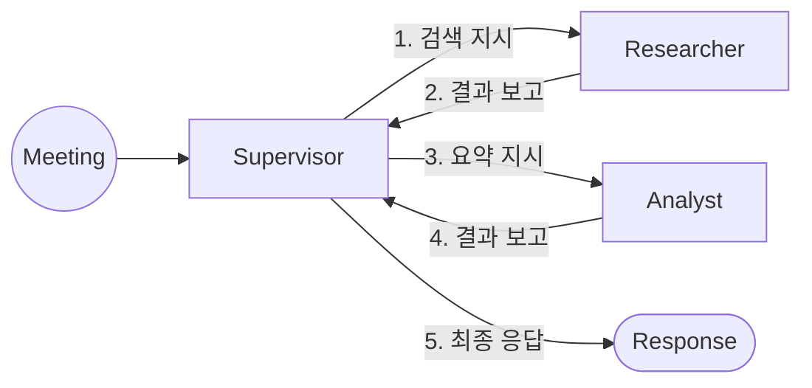

## 3단계: 실제 시나리오 예시

### [SCN-001] 과거 회의 자료 기반 요약

---

### 🎯 시나리오 개요

- **의도:** 특정 날짜의 회의 내용을 찾아 요약 제공
- **트리거:**

  ```
  "이전 9월 8일 2시경에 A회의 자료 좀 가져와봐"
  ```

---

## 🔄 전체 흐름 (멀티 에이전트)



---

## 📊 단계별 실행 흐름 (Shared State 기준)

| 단계 | 실행 노드  | Input (SharedState 읽기) | Output (SharedState 쓰기)                    |
| ---- | ---------- | ------------------------ | -------------------------------------------- |
| 1    | Meeting    | Audio Stream             | `transcript: "9월 8일 회의자료..."`          |
| 2    | Supervisor | `transcript`             | `next_node: "Researcher"`                    |
| 3    | Researcher | `search_query`           | `retrieved_docs: [...]`                      |
| 4    | Supervisor | `retrieved_docs`         | `next_node: "Analyst"` _(결과 검증 후 결정)_ |
| 5    | Analyst    | `retrieved_docs`         | `summary: "..."`                             |
| 6    | Supervisor | `summary`                | `next_node: "end"`                           |

---

## 📌 흐름 해석

- **Meeting → Supervisor**
  - 음성 → 텍스트 변환 후 SharedState에 `transcript` 저장

- **Supervisor (1차 판단)**
  - transcript 기반으로 "검색 필요" 판단 → Researcher 호출

- **Researcher**
  - `search_query` 기반으로 과거 데이터 조회 → `retrieved_docs` 생성

- **Supervisor (2차 판단)**
  - 검색 결과 확인 후 "요약 필요" 판단 → Analyst 호출

- **Analyst**
  - 문서 요약 → `summary` 생성

- **Supervisor (최종 판단)**
  - 결과 확정 후 종료 → 사용자 응답 반환

---

## 🧠 Shared State 예시 흐름

```python
state = {
    "transcript": "9월 8일 회의자료...",
    "search_query": "2023-09-08 14:00 A회의",
    "retrieved_docs": [...],
    "summary": "요약 결과..."
}
```

---

## 🚀 한 줄 핵심

> "모든 데이터는 SharedState에 쌓이고, Supervisor는 그걸 보고 다음 노드를 결정한다"

## 🧠 단계별 데이터 명세

---

### 1️⃣ Supervisor (Coordinator)

**역할:** 사용자 의도를 분석하고 다음 노드 결정

**Input**

```json
{
  "transcript": "이전 9월 8일 2시경에 A회의 자료 좀 가져와봐"
}
```

**Output**

```json
{
  "next_node": "researcher",
  "search_query": "2023-09-08 14:00 A회의"
}
```

---

### 2️⃣ Researcher (Knowledge Domain)

**역할:** 과거 데이터 검색 (DB / Vector DB / 문서)

**Input**

```json
{
  "search_query": "2023-09-08 14:00 A회의"
}
```

**Output**

```json
{
  "retrieved_docs": [
    {
      "title": "A회의록",
      "content": "예산 결의 완료...",
      "date": "2023-09-08"
    }
  ]
}
```

---

### 3️⃣ Analyst (Intelligence Domain)

**역할:** 검색된 문서를 분석 및 요약

**Input**

```json
{
  "retrieved_docs": [
    {
      "title": "A회의록",
      "content": "예산 결의 완료...",
      "date": "2023-09-08"
    }
  ]
}
```

**Output**

```json
{
  "summary": "9월 8일 회의에서 A안건은 예산 승인이 완료되었습니다."
}
```

---

### 4️⃣ Supervisor (최종 응답 결정)

**역할:** 결과를 받아 사용자에게 전달할지 판단

**Input**

```json
{
  "summary": "9월 8일 회의에서 A안건은 예산 승인이 완료되었습니다."
}
```

**Output**

```json
{
  "next_node": "end",
  "response": "9월 8일 회의에서 A안건은 예산 승인이 완료되었습니다."
}
```

---

## 📌 핵심 포인트 (개발자 관점)

### 1. 도메인 간 인터페이스는 JSON으로 통일

- 모든 입출력은 **명확한 스키마(JSON)** 기반
- schemas.py로 강제 검증 가능

---

### 2. 각 도메인은 자기 역할만 수행

- Researcher → 검색만
- Analyst → 요약만
- Supervisor → 흐름 제어만

👉 **비즈니스 책임 분리 (DDD 핵심)**

---

### 3. Shared State에 데이터 축적

```python
# 예시 상태 흐름

state = {
    "transcript": "...",
    "search_query": "...",
    "retrieved_docs": [...],
    "summary": "..."
}
```

👉 모든 노드는 이 state를 읽고 수정

---

### 4. LangGraph 매핑 구조

```python
# workflow.py 예시

graph.add_node("supervisor", supervisor_node)
graph.add_node("researcher", researcher_node)
graph.add_node("analyst", analyst_node)

graph.set_entry_point("supervisor")
```

---

## 🚀 한 줄 핵심

> "각 도메인은 하나의 역할만 수행하고, Supervisor가 전체 흐름을 지휘한다"

---

## 🔥 이 문서의 목적

👉 각 도메인 개발자가 이걸 보고 바로 이해해야 함

- 나는 어떤 input을 받는가?
- 나는 어떤 output을 내야 하는가?
- 다음 노드는 누구인가?

---

원하면 다음 단계로
👉 **SCN-002 (실시간 회의 요약)**
👉 **SCN-003 (액션 아이템 자동 생성)**

까지 이어서 만들어줄게 (이게 포폴 핵심임)
